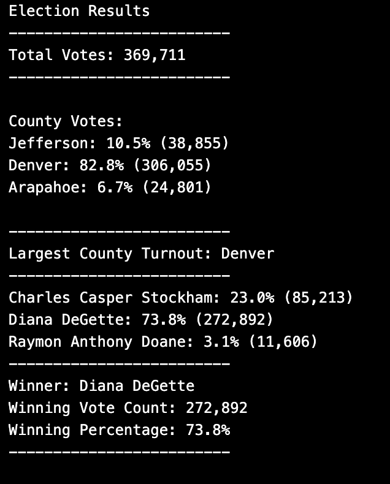
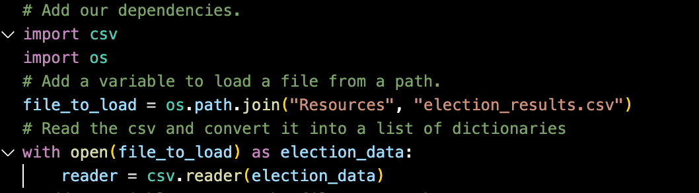
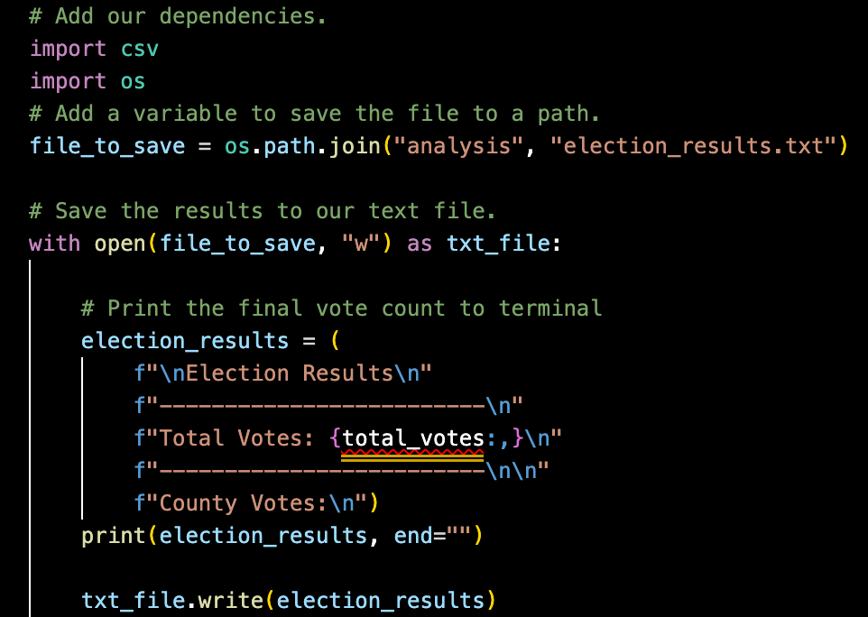
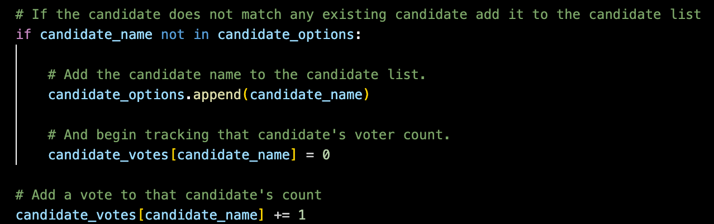
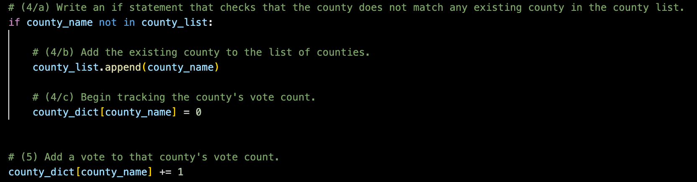

# Election_Analysis

## Project Overview
### <ins> Purpose </ins>
The following anaylsis generates a vote count report using an automated python loop in order to generate the election audit results so that they maybe submitted to the election commission, whre teh analysis output file genreated displays the following information as requested:

   1. The <ins>**total number**</ins> of votes casted.
   2. The complete list of <ins>**counties**</ins> in the congressional precinct. 
      - The <ins>**percentage of votes from each county**</ins> out of the total count.
      - The <ins>**voter turnout for each county**</ins>. 
   3. The county with the <ins>**highest turnout**</ins>.
   4. The complete list of <ins>**candidates**</ins> who received votes. 
      - The <ins>**percentage of votes each candidate**</ins> won and 
      - The <ins>**total number of votes each candidate**</ins> received.
   5. The <ins>**winner of the election**</ins> based on popular vote.
   
  
### <ins>Background</ins>
In order to accomplsh the following task, raw data was collected from the Colarado Preceints in question through the following 3 methods:
  1. <ins>**Mail-in ballots**</ins> - that are initially sent to the central office by eligible voters to then be hand-counted and recorded.
  2. <ins>**Punch cards**</ins>- A traditional analogue way of collecting votes using an automated teller to tally, record, and transmit the data 
  3. <ins>**DRE**</ins> - i.e. direct-recording electronic counting such that memory cards are utilised and read by a computer in order to store information and electronically transmit the data to the central office.

Once all the votes ahd been casted, tallied, and officially recorded, a .csv file containing three columns referring to 


1. Ballot ID (Column A)   
2. County (Column B)   
3. Candidate [Name] (Column C)
     
  
had been created so that further back end processing using **python script** could be done with ease with VS Code being the IDE (Integrated Development Environment (IDE) of choice. A [copy](resources/election_results.csv) of the elction data used can be found following the specified link, while the final results were written on a .txt file that can be found [here](Analysis/election_results.txt)


## <ins>Results</ins>
The final results as provided by the script into the [election_analysis.txt](analysis/election_results.txt) can be summarized into two sections, by candidate and then by county, and are summarized below:

### <ins>By Candidate</ins>
- The quiantitative analysis of the electorial cadidates shows:
  - There were **369,711** votes cast in the election.
- The electorial candidates who ran for a position were:
    - Charles Casper Stockham
    - Diana DeGette
    - Raymon Anthony Doane
- A breakdown of each electorial candidate in terms of votes accumulated presents as:
    - Charles Casper Stockham received **85,213** votes implying a **23.0%** voter share.
    - Diana DeGette received **272,892%** votes implying a **73.8%** voter share
    - Raymon Anthony Doane received **11,606%** vote implying a **3.1%** voter share.
- The winner of the election decisivly being <ins>**Diana DeGette**</ins>

### <ins>By County</ins>
- A quantitavie analysis of the electorial resuls by counts shows us that:
- The counties results were:
    - Jefferson with a **10.5%** voter turnout of the total count and an accumulated **38,855** votes having been casted.
    - Denver with an **82.8%** voter turnout of the total count and an accumulated **306,055** votes having been casted.
    - Arapahoe with a **6.7%** voter turnout of the total count and an accumulated **24,801** votes having been casted.

- With the county having the largest turnout being <ins>**Denver**</ins>


The final output as displayed by the [election_analysis.txt](analysis/election_results.txt) can be seen below. (Notably, the same output can be found within terminal/GitBash when running the [PyPoll](PyPoll_Challenge.py) file found in the root directory.

<p align="center">
 
</p>

### <ins>Overview of the methods and code</ins>
#### <ins>Open, read & write the file</ins>
In order to get started with the .csv file in our IDE, we must first open and read the data as well as create a seperate writable file in order to store our output results.

***1. Import dependencies.***

```python s=
import csv
import os
```

- `import csv` - allows to easily pull in data from externally stored CSV files and perform operations on them. This dependency also includes the following functions:
   - `next()` - skips the row (most commonly used to skip a header row).
   - `reader()` - reads each row from the csv file and return data as a series of mutable and indexed list of strings (each row is a new list) such that looping operations maybe carried out on the data set

- `import os` - allows to interact with the operating system. This dependency also includes the following functions:
   - `path()` - allows us to access files on different operating systems.
   - `join()` - joins file path components together when they are provided as separate strings.
   </br>
      - such that out resultant code is as follows 


```python s=
file_to_load = os.path.join("Resources", "election_results.csv")
```

:exclamation: Directory has to be provided exactly, letter case matters as i found out the hard way when encoutering a erronous space in the name of my file but not wehn recalled within the path.

***3. Open and read the file.***

```python s=
with open(file_to_load) as election_data:
   file_to_read = csv.reader(election_data)
```

- `with open()` - statement opens the file and ensures the proper acquisition of data without having to close the file, so the data isn’t lost or corrupted.
- `as <new_variable_name>` - assigning alias to a variable.
- `csv.reader()` - reads each row from the csv file and returns data as lists of strings. 
- `file_to_read` - a new variable that will be used in the for loop to access the elements via indexes.
- `election_data` - passing an argument to a function, a file that we want function to read.

<p align="center">
Code in order to open and read a file.
</p>

<p align="center">
 
</p>


***4. Declare and and skip the header row.***

```python s=
header = next(file_to_read)
```
- `next()` - function will skip first row in file_to_read.
Retrieves the next item from the iterator by calling its __next__() method. If default is given, it is returned if the iterator is exhausted, otherwise StopIteration is raised


***5. Additional code for writing a file.***

```python s=
file_to_save = os.path.join("Analysis", "election_results.txt")
```
Similar to our `file_to_load` This line of code will create a file called "*election_results.txt*" within the “*Analysis*" folder.

```python s=
with open(file_to_save, "w") as txt_file:
```
In this function, we specified the method `“w”` as the file needs to be editied and so has to be `writable` as comapred to `“r"` which would imply that the file should need only be `readable`.

```python s=
txt_file.write(election_results)
```
With the Python function `write()` we declare what to write in a txt_file. txt_file is a new variable that is passed on from “original variable file_to_save”. In parentheses (election_results) isthe name of the file that has to be written on and so already having open the specified folder in VS Code, a file path has now been specified.

<p align="center">
Code to open and write to a file (Note: *total_votes* shows up as an error as that variable had not yet been initialzied).
</p>

<p align="center">
 
</p>

#### <ins>Looping through dictionaries and the lists</ins>
<p align="center">
   
</p>

<p align="center">
Click to enlarge images
</p>

```python s=
   # If the candidate does not match any existing candidate add it to the candidate list
        if candidate_name not in candidate_options:

            # Add the candidate name to the candidate list.
            candidate_options.append(candidate_name)

            # And begin tracking that candidate's voter count.
            candidate_votes[candidate_name] = 0

        # Add a vote to that candidate's count
        candidate_votes[candidate_name] += 1
```
The script above was used to itterate through rows *both* when accumulating results for cadidate and county replacing the neccessary variables as needed (refer to images for python script). The pyton script makes use of both lists and dictionaries as due to the difference in their properties where the differ in terms of mutability and indexing i.e. lists are ordered (indexed) whereas dictionalries are not 

#### <ins>Retrieving values </ins>

There are two ways to retrive values from a dictionary using theier unique keys. The utilization of either syntax - **"square brackets"** or  **"get()" function** - While each code makes use of different variables in order to analyze a different scenario, the variables are replacable whereas the syntax stands. Use of either of the syntax's return the same result ceteris paribus but the use case is scenario dependant e.g should you expect an error when running your retreival, he get() funtion returns "None" or a default value of your choice, if the key is not found and so may prove easier to debug in the long run:

using square brackets:

```python s=
for candidate_name in candidate_votes:
   votes = candidate_votes[candidate_name]
```
using get() funtion:
```python s=
for county_name in county_dict:
    county = county_dict.get(county_name)
```

### <ins>Finding a winner</ins>

Determine winning vote count, winning percentage, and candidate:
```python s=
if (votes > winning_count) and (vote_percentage > winning_percentage):
    winning_count = votes
    winning_candidate = candidate_name
    winning_percentage = vote_percentage
    
if (county > winning_county) and (county_percentage > county_finalist_percentage):
            winning_county = county
            county_finalist = county_name
```           

All variables were previously created and initialized either as an integer or string. The script starts an if statement comparing individual values against each other such that if the condition holds true, the initialized variable then holds the *New highest value* and then passed down to the new variables `winning_count` `winning_candidate` ` winning_percentage` ` winning_county` ` county_finalist`.

## <ins>Summary </ins>
The Written script analyzes and examines the data quickly and effeciently demonstrating the power in automation using python scripture processing and returning final results for the electiorial race in Colarado. 

This code will automatically:
- find candidates names,
- find counties,  
- calculate total votes cast
- count votes per each candidate/county and calculate vote %,
- declare a county with the highest turnout,
- declare a candidate winner based upon the highest vote count and % (displaying both pieces of information),
- output all the above into a separate .txt file 

Furthermore the script is also flexible in its use case application such that it can be further adopetd in a number of ways to:

- While his code currently reads csv files, it can be ammended to read other file formats when importing our dependancies i.e. 
```python s=
import HTML
import JSON
import XML
```
just to name a few allowing fexibilty over the type of data utilized 

- The code could also be utilized for a number of applications that tally any sort of individualized unique input to output a total final count not only an electoral race but lets say students at a university choosing their favorite meals so that food services can better forecast what to purchase to meet he need of the students
- alternatively we could also `import datetime` should the resultant output be of a time sensitive nature say in a medical lab setting to measure innoculation times of antibiotics averaging out and returning the fastest working antibiotic on a certain bacteria.

